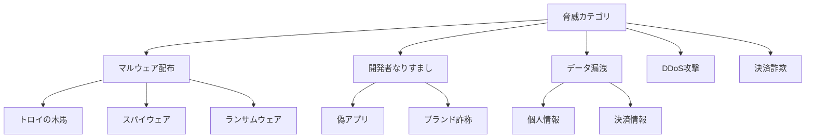

# 第三者アプリストアのセキュリティ実装完全ガイド：脅威対策から実装まで

## はじめに

第三者アプリストアを運営する上で、セキュリティは最重要課題です。Apple App StoreやGoogle Play Storeが長年築いてきた信頼を、新規参入者がどう獲得するか。本記事では、実装レベルでセキュリティ対策を解説します。

## 1. 脅威モデリングと対策概要

### 1.1 主要な脅威カテゴリ



### 1.2 多層防御アーキテクチャ

```typescript
// security-layers.config.ts
export const SecurityLayers = {
  // Layer 1: ネットワーク層
  network: {
    ddosProtection: 'Cloudflare',
    waf: 'AWS WAF',
    rateLimiting: true,
    geoBlocking: ['high_risk_countries'],
  },
  
  // Layer 2: アプリケーション層
  application: {
    authentication: 'OAuth2.0 + MFA',
    authorization: 'RBAC + ABAC',
    encryption: 'AES-256-GCM',
    sessionManagement: 'JWT with rotation',
  },
  
  // Layer 3: データ層
  data: {
    encryptionAtRest: 'AES-256',
    encryptionInTransit: 'TLS 1.3',
    dataClassification: true,
    pii_handling: 'tokenization',
  },
  
  // Layer 4: 監査層
  audit: {
    logging: 'centralized',
    monitoring: '24/7',
    alerting: 'real-time',
    compliance: ['GDPR', 'PCI-DSS'],
  },
};
```

## 2. アプリスキャニングシステムの実装

### 2.1 静的解析エンジン

```typescript
// static-analysis.service.ts
import { Injectable } from '@nestjs/common';
import * as fs from 'fs-extra';
import * as path from 'path';
import { exec } from 'child_process';
import { promisify } from 'util';

const execAsync = promisify(exec);

@Injectable()
export class StaticAnalysisService {
  private readonly RISK_PATTERNS = {
    high: [
      /exec\s*\(/g,  // 任意コード実行
      /eval\s*\(/g,  // 動的コード評価
      /Runtime\.getRuntime\(\)/g,  // Javaランタイムアクセス
      /\.loadLibrary\(/g,  // ネイティブライブラリ読み込み
    ],
    medium: [
      /android\.permission\.INTERNET/g,
      /android\.permission\.ACCESS_FINE_LOCATION/g,
      /android\.permission\.CAMERA/g,
    ],
    low: [
      /android\.permission\.VIBRATE/g,
      /android\.permission\.WAKE_LOCK/g,
    ],
  };

  async analyzeAPK(apkPath: string): Promise<AnalysisResult> {
    const tempDir = await this.extractAPK(apkPath);
    
    try {
      // DEXファイルの逆コンパイル
      const decompiledPath = await this.decompileDEX(tempDir);
      
      // コード分析
      const codeRisks = await this.analyzeCode(decompiledPath);
      
      // マニフェスト分析
      const manifestRisks = await this.analyzeManifest(tempDir);
      
      // リソース分析
      const resourceRisks = await this.analyzeResources(tempDir);
      
      // 証明書分析
      const certInfo = await this.analyzeCertificate(apkPath);
      
      // 既知のマルウェアシグネチャチェック
      const malwareCheck = await this.checkMalwareSignatures(tempDir);
      
      return {
        riskScore: this.calculateRiskScore(codeRisks, manifestRisks, resourceRisks),
        codeRisks,
        manifestRisks,
        resourceRisks,
        certificate: certInfo,
        malware: malwareCheck,
        timestamp: new Date(),
      };
    } finally {
      await fs.remove(tempDir);
    }
  }

  private async analyzeCode(codePath: string): Promise<CodeRisk[]> {
    const risks: CodeRisk[] = [];
    const files = await this.getAllFiles(codePath, '.java');
    
    for (const file of files) {
      const content = await fs.readFile(file, 'utf-8');
      
      // 危険なパターンの検出
      for (const [level, patterns] of Object.entries(this.RISK_PATTERNS)) {
        for (const pattern of patterns) {
          const matches = content.match(pattern);
          if (matches) {
            risks.push({
              file: path.relative(codePath, file),
              level: level as RiskLevel,
              pattern: pattern.source,
              matches: matches.length,
              lines: this.findLineNumbers(content, pattern),
            });
          }
        }
      }
      
      // 難読化の検出
      if (this.isObfuscated(content)) {
        risks.push({
          file: path.relative(codePath, file),
          level: 'medium',
          pattern: 'obfuscation',
          matches: 1,
          lines: [],
        });
      }
    }
    
    return risks;
  }

  private async checkMalwareSignatures(appPath: string): Promise<MalwareCheckResult> {
    // YARA rulesを使用したマルウェア検出
    const yaraRules = await this.loadYaraRules();
    const { stdout } = await execAsync(`yara -r ${yaraRules} ${appPath}`);
    
    const detections = stdout.split('\n').filter(line => line.trim());
    
    // VirusTotalAPI統合
    const vtResults = await this.checkVirusTotal(appPath);
    
    return {
      detected: detections.length > 0 || vtResults.positives > 0,
      yaraMatches: detections,
      virusTotalScore: `${vtResults.positives}/${vtResults.total}`,
      threats: [...detections, ...vtResults.threats],
    };
  }

  private isObfuscated(code: string): boolean {
    // 難読化の指標
    const indicators = {
      shortVariableNames: /\b[a-z]{1,2}\b/g,
      nonAsciiIdentifiers: /[^\x00-\x7F]/,
      highEntropy: this.calculateEntropy(code) > 4.5,
      excessiveStringConcatenation: (code.match(/\+\s*"/g) || []).length > 50,
    };
    
    let score = 0;
    if ((code.match(indicators.shortVariableNames) || []).length > 100) score++;
    if (indicators.nonAsciiIdentifiers.test(code)) score++;
    if (indicators.highEntropy) score++;
    if (indicators.excessiveStringConcatenation) score++;
    
    return score >= 2;
  }

  private calculateEntropy(str: string): number {
    const freq: Record<string, number> = {};
    for (const char of str) {
      freq[char] = (freq[char] || 0) + 1;
    }
    
    let entropy = 0;
    const len = str.length;
    
    for (const count of Object.values(freq)) {
      const p = count / len;
      entropy -= p * Math.log2(p);
    }
    
    return entropy;
  }
}
```

### 2.2 動的解析サンドボックス

```typescript
// sandbox.service.ts
import { Injectable } from '@nestjs/common';
import { DockerService } from './docker.service';

@Injectable()
export class SandboxService {
  constructor(private dockerService: DockerService) {}

  async analyzeAppBehavior(apkPath: string): Promise<BehaviorAnalysis> {
    // Androidエミュレータコンテナの起動
    const containerId = await this.dockerService.createContainer({
      image: 'android-emulator:api-30',
      memory: '4g',
      cpu: '2',
      network: 'isolated',
    });

    try {
      // APKのインストール
      await this.installAPK(containerId, apkPath);
      
      // システムコール監視開始
      const syscallMonitor = this.startSyscallMonitoring(containerId);
      
      // ネットワークトラフィック監視
      const networkMonitor = this.startNetworkMonitoring(containerId);
      
      // ファイルシステム監視
      const fsMonitor = this.startFileSystemMonitoring(containerId);
      
      // アプリの起動と自動操作
      await this.launchAndInteract(containerId);
      
      // 監視結果の収集
      const behavior = {
        syscalls: await syscallMonitor.getResults(),
        network: await networkMonitor.getResults(),
        fileSystem: await fsMonitor.getResults(),
        permissions: await this.checkRuntimePermissions(containerId),
        dataLeaks: await this.detectDataLeaks(containerId),
      };
      
      return this.analyzeBehavior(behavior);
    } finally {
      await this.dockerService.removeContainer(containerId);
    }
  }

  private async detectDataLeaks(containerId: string): Promise<DataLeak[]> {
    const leaks: DataLeak[] = [];
    
    // 送信データの監視
    const networkLog = await this.getNetworkLog(containerId);
    
    // 個人情報パターンの検出
    const patterns = {
      email: /[a-zA-Z0-9._%+-]+@[a-zA-Z0-9.-]+\.[a-zA-Z]{2,}/g,
      phone: /\+?[0-9]{10,15}/g,
      creditCard: /\b(?:\d{4}[-\s]?){3}\d{4}\b/g,
      imei: /\b\d{15}\b/g,
      androidId: /[a-f0-9]{16}/g,
    };
    
    for (const [type, pattern] of Object.entries(patterns)) {
      const matches = networkLog.match(pattern);
      if (matches) {
        leaks.push({
          type: type as DataType,
          destination: this.extractDestination(networkLog, matches[0]),
          encrypted: this.isEncrypted(networkLog),
          timestamp: new Date(),
        });
      }
    }
    
    return leaks;
  }

  private startSyscallMonitoring(containerId: string) {
    return {
      getResults: async () => {
        const { stdout } = await this.dockerService.exec(containerId, 
          'strace -p $(pidof com.target.app) -o /tmp/syscalls.log'
        );
        
        // 危険なシステムコールの検出
        const dangerousCalls = [
          'execve',  // プロセス実行
          'ptrace',  // デバッグ/アンチデバッグ
          'mprotect', // メモリ保護変更
          'dlopen',   // 動的ライブラリ読み込み
        ];
        
        const log = await this.dockerService.readFile(containerId, '/tmp/syscalls.log');
        const risks = dangerousCalls.filter(call => log.includes(call));
        
        return { dangerousCalls: risks, totalCalls: log.split('\n').length };
      },
    };
  }
}
```

## 3. 開発者認証とKYCシステム

### 3.1 多要素認証実装

```typescript
// developer-auth.service.ts
import { Injectable } from '@nestjs/common';
import * as speakeasy from 'speakeasy';
import * as QRCode from 'qrcode';
import { authenticator } from 'otplib';

@Injectable()
export class DeveloperAuthService {
  async setupMFA(developerId: string): Promise<MFASetup> {
    // TOTP秘密鍵の生成
    const secret = speakeasy.generateSecret({
      name: `AppStoreBank (${developerId})`,
      issuer: 'AppStoreBank',
      length: 32,
    });

    // バックアップコードの生成
    const backupCodes = this.generateBackupCodes(10);
    
    // QRコードの生成
    const qrCodeUrl = await QRCode.toDataURL(secret.otpauth_url);
    
    // 秘密情報の暗号化保存
    await this.saveMFASecret(developerId, {
      secret: this.encrypt(secret.base32),
      backupCodes: backupCodes.map(code => this.hashBackupCode(code)),
      createdAt: new Date(),
    });
    
    return {
      qrCode: qrCodeUrl,
      secret: secret.base32,
      backupCodes,
    };
  }

  async verifyMFA(developerId: string, token: string): Promise<boolean> {
    const mfaData = await this.getMFAData(developerId);
    
    if (!mfaData) {
      throw new Error('MFA not configured');
    }
    
    // バックアップコードチェック
    if (await this.isBackupCode(developerId, token)) {
      await this.consumeBackupCode(developerId, token);
      return true;
    }
    
    // TOTPトークン検証
    const secret = this.decrypt(mfaData.secret);
    const isValid = authenticator.verify({
      token,
      secret,
      window: 2, // 前後2つの時間枠を許容
    });
    
    // リプレイ攻撃防止
    if (isValid) {
      await this.preventReplay(developerId, token);
    }
    
    return isValid;
  }

  private generateBackupCodes(count: number): string[] {
    const codes: string[] = [];
    for (let i = 0; i < count; i++) {
      const code = Math.random().toString(36).substring(2, 10).toUpperCase();
      codes.push(`${code.slice(0, 4)}-${code.slice(4, 8)}`);
    }
    return codes;
  }
}
```

### 3.2 KYC（本人確認）実装

```typescript
// kyc.service.ts
import { Injectable } from '@nestjs/common';
import * as AWS from 'aws-sdk';

@Injectable()
export class KYCService {
  private rekognition = new AWS.Rekognition();
  private textract = new AWS.Textract();

  async verifyIdentity(documents: KYCDocuments): Promise<KYCResult> {
    // Step 1: 書類の真正性確認
    const documentVerification = await this.verifyDocument(documents.idDocument);
    
    // Step 2: 顔認証
    const faceVerification = await this.verifyFace(
      documents.idDocument,
      documents.selfie
    );
    
    // Step 3: 書類情報の抽出
    const extractedInfo = await this.extractDocumentInfo(documents.idDocument);
    
    // Step 4: 外部データベース照合
    const externalVerification = await this.verifyWithExternalDB(extractedInfo);
    
    // Step 5: リスクスコアリング
    const riskScore = this.calculateRiskScore({
      documentVerification,
      faceVerification,
      externalVerification,
    });
    
    return {
      verified: riskScore < 30,
      riskScore,
      extractedInfo,
      verificationDetails: {
        document: documentVerification,
        face: faceVerification,
        external: externalVerification,
      },
    };
  }

  private async verifyDocument(documentImage: Buffer): Promise<DocumentVerification> {
    // AWS Textractで文書解析
    const analysis = await this.textract.analyzeDocument({
      Document: { Bytes: documentImage },
      FeatureTypes: ['FORMS', 'TABLES'],
    }).promise();
    
    // セキュリティ特徴の検出
    const securityFeatures = await this.detectSecurityFeatures(documentImage);
    
    return {
      authentic: securityFeatures.hologram && securityFeatures.watermark,
      confidence: securityFeatures.confidence,
      documentType: this.identifyDocumentType(analysis),
      expiryDate: this.extractExpiryDate(analysis),
    };
  }

  private async verifyFace(idPhoto: Buffer, selfie: Buffer): Promise<FaceVerification> {
    // AWS Rekognitionで顔比較
    const comparison = await this.rekognition.compareFaces({
      SourceImage: { Bytes: idPhoto },
      TargetImage: { Bytes: selfie },
      SimilarityThreshold: 90,
    }).promise();
    
    if (!comparison.FaceMatches || comparison.FaceMatches.length === 0) {
      return { matched: false, confidence: 0, livenessCheck: false };
    }
    
    // 生体検出（なりすまし防止）
    const livenessCheck = await this.checkLiveness(selfie);
    
    return {
      matched: true,
      confidence: comparison.FaceMatches[0].Similarity,
      livenessCheck: livenessCheck.isLive,
    };
  }

  private async checkLiveness(image: Buffer): Promise<LivenessResult> {
    // 顔の品質チェック
    const faceDetail = await this.rekognition.detectFaces({
      Image: { Bytes: image },
      Attributes: ['ALL'],
    }).promise();
    
    if (!faceDetail.FaceDetails || faceDetail.FaceDetails.length === 0) {
      return { isLive: false, confidence: 0 };
    }
    
    const face = faceDetail.FaceDetails[0];
    
    // 生体指標の確認
    const livenessIndicators = {
      eyesOpen: face.EyesOpen?.Value || false,
      mouthOpen: face.MouthOpen?.Value || false,
      sunglasses: !(face.Sunglasses?.Value || false),
      emotions: face.Emotions?.some(e => e.Confidence > 50) || false,
    };
    
    const score = Object.values(livenessIndicators).filter(v => v).length;
    
    return {
      isLive: score >= 3,
      confidence: (score / 4) * 100,
    };
  }
}
```

## 4. ゼロトラストアーキテクチャ

### 4.1 マイクロセグメンテーション

```typescript
// zero-trust.config.ts
export const ZeroTrustConfig = {
  // すべてのアクセスを検証
  policies: [
    {
      resource: '/api/apps/upload',
      requirements: {
        authentication: ['mfa'],
        deviceTrust: ['managed', 'compliant'],
        location: ['allowed_countries'],
        timeWindow: 'business_hours',
      },
    },
    {
      resource: '/api/admin/*',
      requirements: {
        authentication: ['mfa', 'hardware_key'],
        deviceTrust: ['corporate_device'],
        network: ['corporate_vpn'],
      },
    },
  ],
  
  // 継続的な検証
  continuousVerification: {
    interval: 300, // 5分ごと
    checks: ['session_validity', 'device_compliance', 'behavior_anomaly'],
  },
  
  // 最小権限の原則
  rbac: {
    roles: {
      developer: ['app:upload', 'app:update', 'analytics:read'],
      reviewer: ['app:review', 'app:approve', 'app:reject'],
      admin: ['*'],
    },
  },
};
```

## 5. インシデントレスポンス

### 5.1 自動対応システム

```typescript
// incident-response.service.ts
@Injectable()
export class IncidentResponseService {
  async handleSecurityIncident(incident: SecurityIncident): Promise<void> {
    // 重要度の判定
    const severity = this.assessSeverity(incident);
    
    // 自動対応の実行
    switch (severity) {
      case 'critical':
        await this.criticalResponse(incident);
        break;
      case 'high':
        await this.highResponse(incident);
        break;
      case 'medium':
        await this.mediumResponse(incident);
        break;
    }
    
    // 証跡の保全
    await this.preserveEvidence(incident);
    
    // 通知
    await this.notifyStakeholders(incident, severity);
  }

  private async criticalResponse(incident: SecurityIncident): Promise<void> {
    // 即座にアプリを無効化
    if (incident.type === 'malware_detected') {
      await this.quarantineApp(incident.appId);
      await this.notifyAffectedUsers(incident.appId);
      await this.revokeDownloadLinks(incident.appId);
    }
    
    // アカウントの凍結
    if (incident.type === 'developer_compromise') {
      await this.freezeDeveloperAccount(incident.developerId);
      await this.auditAllApps(incident.developerId);
    }
    
    // ネットワークの隔離
    if (incident.type === 'system_breach') {
      await this.isolateNetwork(incident.affectedSystems);
      await this.activateDisasterRecovery();
    }
  }
}
```

## まとめ

第三者アプリストアのセキュリティは、技術的対策だけでなく、プロセスと人の要素も含めた総合的なアプローチが必要です。本記事で紹介した実装を参考に、ユーザーが安心して利用できるプラットフォームを構築してください。

次回は、高可用性を実現するCDN配信システムの構築について解説します。

## 参考資料

- [OWASP Mobile Security Testing Guide](https://owasp.org/www-project-mobile-security-testing-guide/)
- [NIST Cybersecurity Framework](https://www.nist.gov/cyberframework)
- [Android Security Best Practices](https://developer.android.com/topic/security/best-practices)
- [Zero Trust Architecture - NIST SP 800-207](https://www.nist.gov/publications/zero-trust-architecture)